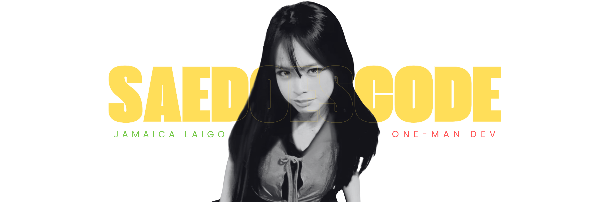

<p align="center">
  
</p>

<p align="center">
  
  
</p>

---

>   where creativity meets development.

<div align="center">
  
</div>

---

## `$ skills --list`

### `web · frontend`

<p>
  
</p>

### `languages`

<p>
  
</p>

### `backend · data`

<p>
  
</p>

### `tools`

<p>
  
</p>

---

## `$ currently --building`

```text
▸ Web applications
▸ Developer tools
▸ Freelance projects
▸ Random ideas that somehow become projects
```

---

## `$ contact --me`

<p align="center">
  <a href="https://github.com/saedoescode">
    
  </a>
</p>

<p align="center">
  <sub>Built with questionable amounts of caffeine ☕</sub>
</p>
